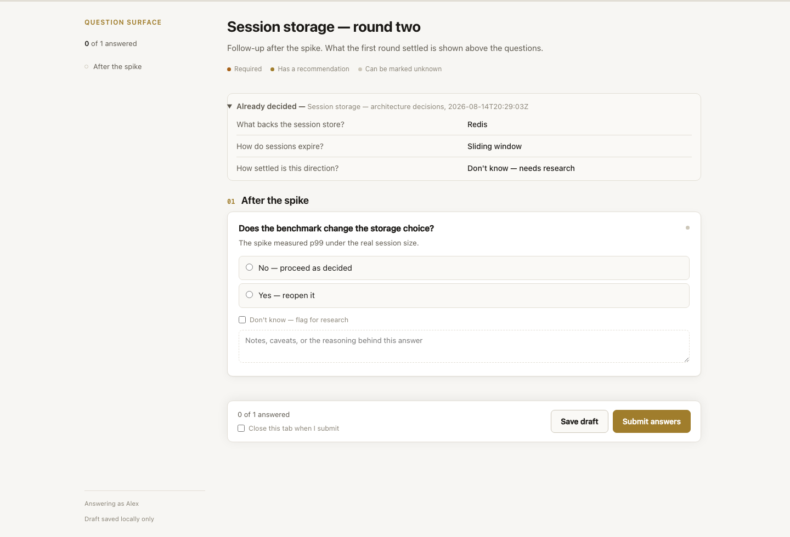
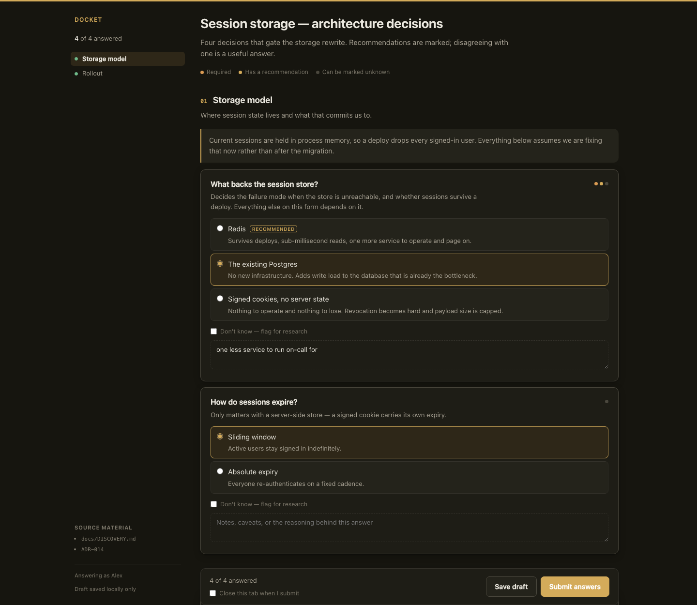

# Question Surface

**Your coding agent has eight questions. It should ask them once, on one screen, with the tradeoffs visible — not one at a time in chat until you stop reading.**

[](https://github.com/avanrossum/question-surface/actions/workflows/test.yml)


Question Surface is a local web form an agent builds on demand, serves on loopback, and shuts down the moment you submit. The answers land on disk as JSON your agent reads directly, and as markdown you can commit next to the code the decisions are about.

It also does [interviews](#interview-mode) — one question at a time, each one written after reading your last answer.


---

## The problem it solves

Serialized question-and-answer is a lossy channel for decisions.

- Each answer arrives without the others in view, so you never see the tradeoffs between them.
- Question eight gets a shorter answer than question one.
- Conditional follow-ups arrive three messages after the context that made them meaningful.
- Everything ends up in a transcript nobody re-reads, so the next session re-derives half of it.

One screen fixes all four, and leaves a record behind.

---

## What you get back

Every submission writes two files. The JSON is what the agent reads:

```json
{
  "questionnaire_id": "session-storage",
  "respondent": "Alex",
  "submitted_at": "2026-08-14T19:07:00Z",
  "counts": { "total": 4, "answered": 4, "unknown": 1, "unanswered": 0, "skipped": 1 },
  "flagged_unknown": ["confidence"],
  "answers": {
    "backing-store": {
      "prompt": "What backs the session store?",
      "value": "postgres",
      "labels": ["The existing Postgres"],
      "notes": "one less service to run on-call for",
      "recommended": "redis",
      "followed_recommendation": false
    }
  }
}
```

Three things in there are the reason this exists:

| Field | Why it matters |
|---|---|
| `flagged_unknown` | "Don't know" is a first-class answer. These become research items, not questions you get asked again. |
| `followed_recommendation` | The agent commits to a view, and the record shows when you overruled it. |
| `skipped` | A question you never saw is recorded as unreachable, not as one you ignored. Completion counts mean what they say. |

The markdown twin is for humans and git diffs.

---

## Install

```bash
git clone https://github.com/avanrossum/question-surface.git
cd question-surface
./install.sh
```

Python 3.9+ and nothing else. No npm, no pip install, no build step, no lockfile to rot.

The installer tells you about all three things it does and asks before the one that touches your files:

1. Symlinks `qsurface` into `~/.local/bin`.
2. Symlinks the skill into `~/.claude/skills/`, so every Claude Code session in every project can use it.
3. Offers to add one line to your global `CLAUDE.md` carrying your question gate.

`./install.sh --uninstall` removes all of it. `qsurface doctor` tells you what is and isn't wired up.

---

## How an agent uses it

```
has questions → writes a spec → serves it → hands you a URL
             → keeps working on what isn't blocked
             → you submit → server exits → reads the answers → proceeds
```

The server dies on submit. No daemon, no port left listening, no cleanup step to forget. If nobody submits, `--timeout` (default two hours) ends the wait, writes nothing, and exits non-zero with your draft intact — a half-finished form is not a decision.

```bash
qsurface new session-storage --title "Session storage decisions"
qsurface validate session-storage
qsurface serve session-storage        # blocks until submitted
qsurface show session-storage         # summary + paths
```

Busy port? It takes a free one and says so, so two agents can ask you things at the same time.

---

## What the form can do

Nine question types — single, multi, ranked, scale, text, longtext, number, date, and non-collecting info blocks. Every question can carry a `why` line stating what the answer unblocks, a recommendation, a "Don't know" toggle, and a notes box.

**Conditionals that actually branch.** A question that only matters down one path is hidden down the other, and evaluated identically in the browser and on the server. Hidden means empty on both sides: no stale radio left checked, no orphan answer smuggled in from a draft.

**Nothing is ever lost.** Every keystroke goes to `localStorage` and a debounced server-side draft. Close the tab, crash the browser, restart the machine — it resumes where you stopped.

**Follow-up rounds show their work.** Point a questionnaire at an earlier one and it renders what that round settled, including anything flagged for research:



**It follows your theme.**



---

## Interview mode

The form is right when the agent already knows every question. When each answer should determine the next one, ask for an interview instead:

> "I'd like to write a post about the outage. Interview me for it, so I capture what actually happened."

One question at a time. You answer, the agent reads it, and the next question comes from what you said — not from a list written before the conversation started.


```bash
qsurface interview open outage --title "Outage retrospective" --domain "incident review"
qsurface interview ask outage --prompt "What broke first?" --why "symptom before cause"
qsurface interview close outage
```

While the agent reads what you said, the page shows it reading rather than spinning:


`open` returns immediately and leaves a detached server. Each `ask` blocks until you answer, then prints the answer to the agent, which writes the next question. The transcript is written after **every** answer, so an interview that gets interrupted still leaves everything said so far.

The skill instructs the agent to conduct it as an expert interviewer in a stated or inferred domain: follow the interesting thread, ask for the concrete when handed an abstraction, notice contradictions, and stop when it has what it needs rather than when a count runs out.

**On dictation.** Speaking an answer suits an interview better than typing one, so the page nudges you toward the dictation already built into your operating system — the microphone key on macOS, `Win+H` on Windows. Not the Web Speech API, which ships your audio to a recognition service and would break the loopback-only rule this tool is built on.

---

## The gate

**Five or more questions go to the surface. Four or fewer can be asked in chat.** Also use it below that count when the answers would benefit from exposition, real answer choices, or open-ended interaction — two genuinely hard forks belong here, four easy questions don't.

The count is yours to set:

```bash
qsurface config gate 3     # then re-run ./install.sh to refresh the pointer line
```

A skill is static text an agent reads, not a program that can look a setting up, which is why the installer writes your number into your global `CLAUDE.md`.

The gate is a floor on batching, not a licence to manufacture questions. Five questions that should have been one routine call the agent was competent to make is worse than asking nothing.

---

## Where things live

Questionnaires and responses go in **the project you are working in**:

```
<your project>/
└── .question-surface/
    ├── questionnaires/<id>.json
    └── responses/<id>/
        ├── <timestamp>.json    # the machine record
        ├── <timestamp>.md      # the human record
        └── draft.json          # in progress, deleted on submit, not tracked
```

A decision belongs in the repository it is about, where it can be reviewed alongside the change it gates and found by whoever clones the project a year from now. Responses are meant to be committed; the tool never touches your git index. The project root is the nearest enclosing repository, so it does not matter which subdirectory you run from.

---

## Design constraints

These are load-bearing and not up for negotiation in a PR:

- **Standard library only.** A tool that rots because its dependencies moved is not durable, and this one has to still run in a year.
- **Loopback only.** No auth, no sessions, no multi-tenancy. It must never be reachable off the machine.
- **No interface of its own.** No Electron, no SPA. Launching a browser at a local page is the whole design.
- **The JSON is authoritative.** The markdown is a regenerable render of it.
- **Validation fails at load.** A duplicate id, a forward-referencing conditional, or a recommendation naming an option that doesn't exist costs a round trip with a human, which is the exact cost this tool exists to remove.

---

## Documentation

- **[Questionnaire format](docs/FORMAT.md)** — every field, every question type, conditionals, and the response document.
- **[Roadmap](ROADMAP.md)** — what was deliberately left out, and why.
- **[Changelog](CHANGELOG.md)** — semver, tagged.
- The bundled `example` questionnaire exercises every feature: `qsurface render example -o /tmp/preview.html`.

---

## Tests

```bash
python3 -m unittest discover -s tests -t .   # 79 tests, about a second
python3 scripts/check_browser.py             # 28 client-side checks in a real browser
```

The browser checks cover `assets/app.js`, which the Python suite cannot reach — both bugs found in the first review lived there. They drive headless Chrome if one is installed and skip cleanly if not, rather than pulling in a JavaScript toolchain and breaking the no-build-step constraint. CI runs the suite on Python 3.9 through 3.13 and the browser checks with `--require`.

## Licence

MIT. See [LICENSE](LICENSE).

---

Screenshots in this README are generated from the real renderer by `scripts/make_screenshots.py`, so they cannot drift from what the tool looks like.
