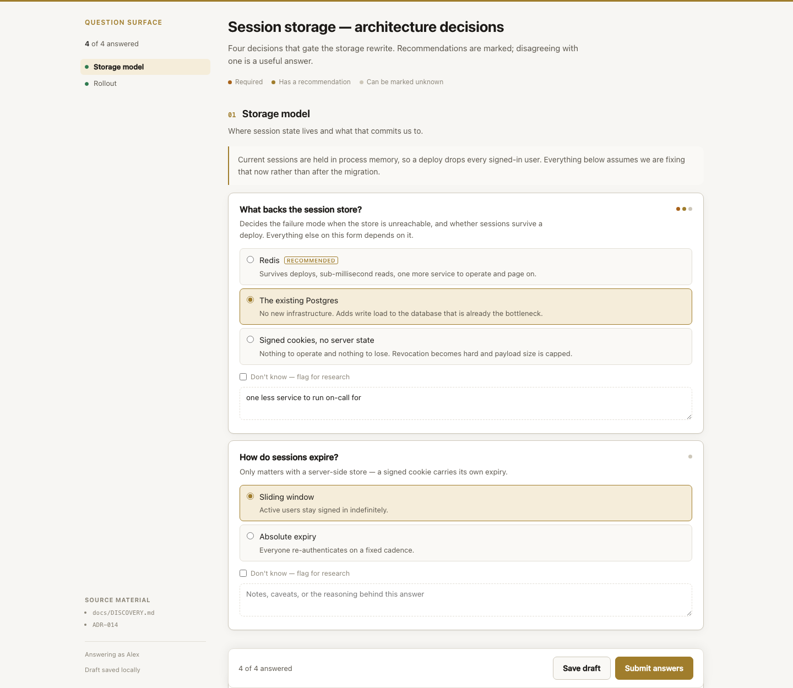
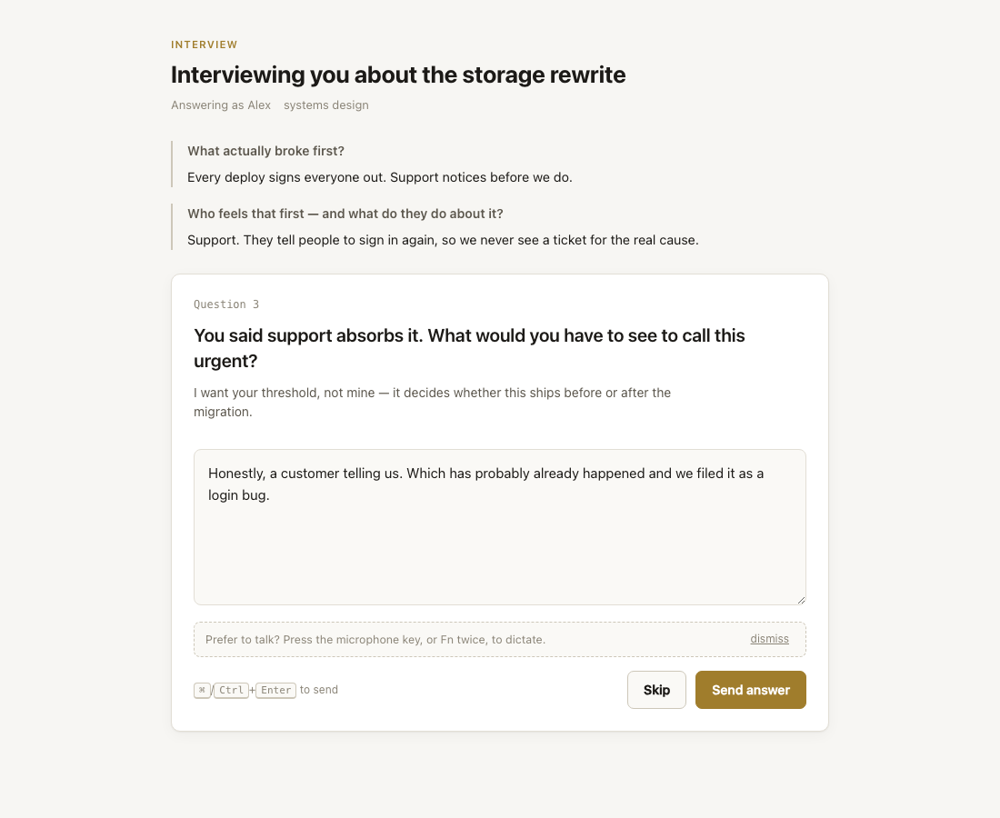
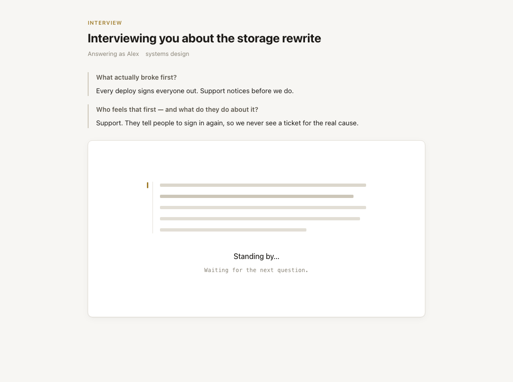
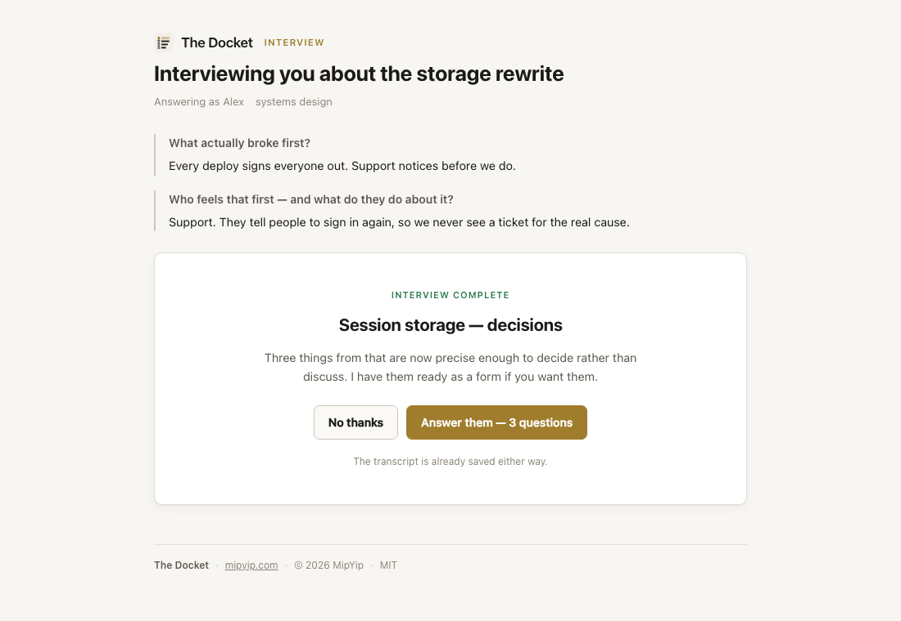

# The Docket

> "Ok, you know what? Please just put all the questions you have for me in a form on an HTML page that saves the answers to a file and I'll answer them all at once."

That was the original request, made mid-session out of irritation at answering a numbered list one item at a time. This is what it became.

[](https://github.com/avanrossum/docket/actions/workflows/test.yml)


The Docket collects your coding agent's open questions into one page you clear in a sitting, and keeps the answers as a record you can commit next to the code they decided.

It builds the page on demand, serves it on loopback, and shuts down when you are done. The answers land on disk as JSON the agent reads directly, and as markdown that diffs.

Two modes, and they work in sequence as often as alone.



---

## Install

```bash
pipx install docket     # or: uv tool install docket, or pip install docket
docket setup
```

`docket setup` installs the Claude Code skill into `~/.claude/skills/` and prints the one line to add to your global `CLAUDE.md`. Without the skill an agent has no reason to reach for the tool at all.

Or from a clone, if you want to edit it:

```bash
git clone https://github.com/avanrossum/docket.git
cd docket
./install.sh
```

That symlinks rather than copies, so `git pull` updates the tool and the skill together.

**Python 3.9+ and nothing else.** No runtime dependencies, no build step, no lockfile to rot — the dependency list in `pyproject.toml` is empty and staying that way. Run `docket doctor` any time to see what is wired up.

---

## A form, when the agent knows what to ask

```bash
docket serve session-storage
```

Every question can carry a `why` line saying what the answer unblocks, a recommendation to react to, a "Don't know — flag for research" toggle, and a notes box. Conditionals branch properly, evaluated the same way in the browser and on the server. Drafts survive a closed tab, a crashed browser, and a restarted machine.

The response records more than your answers. `flagged_unknown` separates "I don't know yet" from "I skipped it", so those become research items instead of questions you get asked twice. `followed_recommendation` records when you overruled the agent. A question you never saw is marked unreachable rather than blank, so the counts mean what they say.

## An interview, when each answer should decide the next question

```bash
docket interview open outage --domain "incident review"
```

One question at a time. You answer, the agent reads it, and the next question comes from what you actually said.



The skill tells the agent to conduct it as an expert interviewer in a stated or inferred domain: follow the thread that opened, ask for the concrete when handed an abstraction, ask about contradictions, and stop when it has what it needs rather than at a count. While it reads, the page shows it reading.



## And then a form, to pin down what the interview turned up

```bash
docket interview distill outage
```

An interview reliably ends with things that have become precise enough to decide rather than discuss. `distill` scaffolds a questionnaire from the transcript, carrying each exchange across as a marked draft for the agent to rewrite. Serving it shows the interview above the questions, so nobody is reconstructing the conversation from memory.

The tool cannot tell which parts of a conversation became decisions, so it does not pretend to — every question it writes is a TODO the agent is expected to replace.

The form then opens in the tab the interview is already in, if you want it:



Declining is a normal answer, and the transcript records which it was.

---

## Why "The Docket"?

A docket is a list of matters awaiting decision, and the record of how each one was disposed of. That is what this hands you, so the name is a description rather than a label.

It was called Question Surface for its first three days, which named the input widget at the moment every agent harness was absorbing input widgets as built-ins. The record is the part worth naming.

---

## Documentation

- **[Usage](docs/USAGE.md)** — every command, the question gate, where files land, how an agent drives it.
- **[Questionnaire format](docs/FORMAT.md)** — every field, all nine question types, conditionals, the response document.
- **[Interviews](docs/INTERVIEWS.md)** — running one, conducting one well, the transcript format.
- **[Design and testing](docs/DESIGN.md)** — the constraints, why they hold, and how it is tested.
- **[Roadmap](ROADMAP.md)** · **[Changelog](CHANGELOG.md)**

---

## Why it should still run in a year

Standard library only, so no dependency can move out from under it. Loopback only, with no auth and no session model, because it must never be reachable off the machine. The server exits on submit, so there is no daemon left running. Validation fails at load, so a broken questionnaire costs you nothing.

It has 117 Python tests and 49 client-side checks that drive a real browser, running on Python 3.9 through 3.13 in CI. Those checks have caught six real defects so far, including two that were passing while testing nothing at all.

That last part was an accident. "No bugs. Make no mistakes." went into the original spec as a joke, and then drove a CI matrix, a browser harness, and a habit of verifying claims rather than asserting them. The tool was built in under a day with Claude Code, which is worth knowing mostly because the joke turned out to be the most productive line in the specification.

---

## The story is in the repo

This README was structured from an interview conducted with the tool itself. The transcript is in [`.docket/responses/readme-shape/`](.docket/responses/) — the questions, the answers, and what changed because of them. The decisions that shaped the tool are in the same directory, from the questionnaires that settled them.

That is the tool's own argument, applied to itself: a decision that exists only in a chat transcript is a decision nobody can find later.

If you install it, I would genuinely like to hear what happened — including if it was useless to you, or if you used it for something I did not anticipate. Open an issue.

---

MIT. See [LICENSE](LICENSE).
